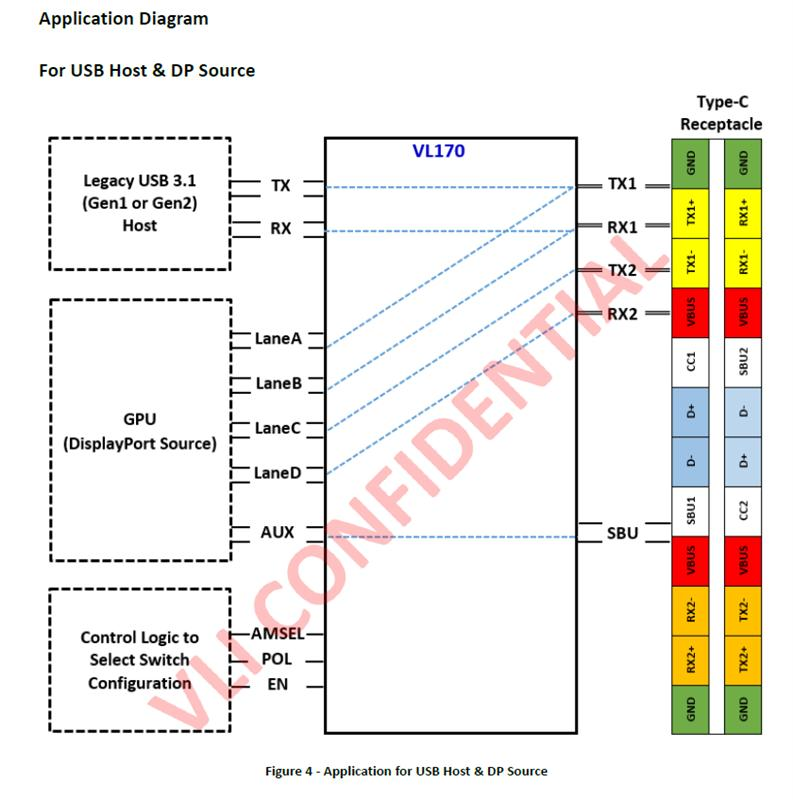

# VL170 chip notes

It can be hard to find USB-C chips doing specifically what you need to do. I'd like to bring news about the chip called VL170,
that lets you do a USB-C host or device port with DP and USB3 highspeed lanes easily. Specifically, it lets you do either USB3 + DisplayPort 2-lane,
or DisplayPort 4-lane, switching the high-speed lanes between USB-C port lanes in whichever way you want.

On the device side, if you're implementing a fixed USB3 + DP arrangement, you typically don't need this; that said, it might still be
handy if for some reason, you'd like to be able to do both 4-lane and 2-lane+USB3 on your device's TypeC port.

There's no CC handling on this chip. That's great for me cuz I'll be doing that externally. It takes three GPIOs from an MCU,
EN, POL (polarity? USB-C port HS signal flipping?) and AMSEL. AMSEL seems to switch between "two-lane DP+USB3" and "four-lane DP"?

You can [buy these on Aliexpress](https://de.aliexpress.com/item/1005004558394310.html), and mebbe Taobao. Not on LCSC. Weh!

First page is [the VIA page](https://www.via-labs.com/product_show.php?id=73), which tells us the device is EOL. Whatever.
Then, there's [the "VIA IC" page](http://www.via-ic.com/product.html?id=24), whatever that site is.

There's no datasheet as far as I've looked. However! There's [this page](https://m.dzsc.com/product/753656-201932712352356.html), and it gave me some 
PNGs! Here they are:

[This page](https://zhuanlan.zhihu.com/p/449807257) also gave me some product brief comparisons.

Looks like the VL171 is the same chip but lower insertion loss. Is nice!

Want a simple DP-only reference design? Here you go!

The chip actually [seems to do bidirectional 
translation](https://www.reddit.com/user/hubsdocks/comments/pjju28/sneak_peek_of_other_usbc_dp_bidirectional_cable/) of DP and USB3, which is a joy!

Do you need to cross USB3 signals over, aka, is this device-side or host-side TX and RX naming? No idea! Do look into that, mebbe can tell from VIA's 
reference board screenshots!

